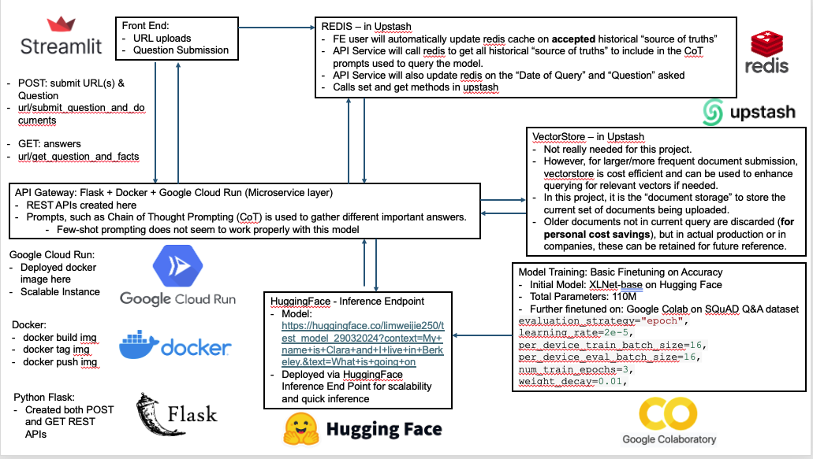

# 📦 Streamlit App Starter Kit 

## Objective

Your task is to create a web application that processes and extracts information from a set of call logs using an LLM.

- The application should allow for a single question to be set and a list of call logs to be provided, from which a set of facts/answers should be provided.
- The application should also allow users to navigate through time, viewing the state of knowledge at different points based on the documents processed up to that date.

For example, consider a call log from a given URL where a team discusses the color scheme for a new app:

```
00:00:10 - Alex: Let's choose our app's color scheme today.
00:00:36 - Jordan: I suggest blue for a calm feel.
00:00:51 - Casey: We need to make sure it's accessible to all users.
```

If the question being asked was “What product design decisions did the team make?”, the application would extract facts such like

- The team will use blue for the color scheme of the app
- The team will make the app accessible to all users

## Demo App
https://sayhellotologs-favqdgrpo9c.streamlit.app/

## System Architecture



## Further Reading
- To see the full BE implementation: https://github.com/weijie-lim/BE-FOR-ML-MODEL-BUILDER 
